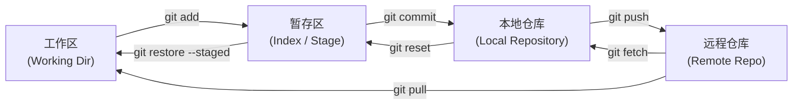

# 🚀 Git 全流程学习规划路线图 · 从入门到精通

> **目标**：从单兵代码管理，到分支协作、团队工作流、底层机制与救命级时光机操作，系统建立 Git 版本控制的工程化思维与肌肉记忆。  
> **预计周期**：15 ~ 21 天（循序渐进）  
> **学习建议**：结合命令行实操与练习网站，边学边敲，每完成一个任务即可勾选打卡。

---

## 📊 阶段全景总览

| 阶段 | 阶段主题 | 核心周期 | 掌握目标 |
| :--- | :--- | :--- | :--- |
| **01** | [单兵作战与版本控制基础](#阶段一单兵作战与版本控制基础day-1--day-3) | Day 1 ~ Day 3 | 搞懂三层架构（工作区/暂存区/本地库），掌握初始化、状态查看、暂存提交与历史比对 |
| **02** | [分支艺术与冲突管理](#阶段二分支艺术与冲突管理day-4--day-7) | Day 4 ~ Day 7 | 掌握分支指针原理、现代 `switch` 语法、Fast-Forward 与三方合并、冲突消解、`stash` 现场保护 |
| **03** | [远程协同与团队工作流](#阶段三远程协同与团队工作流day-8--day-11) | Day 8 ~ Day 11 | SSH Key 免密认证、关联远程、`fetch` 与 `pull --rebase`、PR/MR 工作流与 `.gitignore` 规范 |
| **04** | [高阶技巧与终极后悔药](#阶段四高阶技巧与终极后悔药day-12--day-15) | Day 12 ~ Day 15 | 交互式变基 `rebase -i` 压缩美化历史、`cherry-pick` 精准摘取、`reflog` 绝境救援、`bisect` 二分定位 |
| **05** | [工程化规范与效能工具](#阶段五工程化规范与效能工具day-16) | Day 16+ | Conventional Commits 规范、高效 `alias` 别名配置、现代化 TUI 神器 `lazygit`、语义化 Tag 发布 |

---

## 🧠 Git 核心架构与数据流向

Git 本质上是一个**内容寻址的键值存储系统 + 指针快照树**。在操作命令前，先牢记四层区域之间的数据流向：



- **工作区 (Working Directory)**：你电脑上能直接看到的项目文件，进行代码编辑与增删的场所。
- **暂存区 (Index / Stage)**：准备作为下一个版本提交的快照清单（`.git/index`），是 Git 的核心缓冲设计。
- **本地仓库 (Local Repository)**：本地 `.git` 目录中已持久化的提交对象链（Commit Objects）。
- **远程仓库 (Remote Repository)**：托管在云端（GitHub / Gitee / GitLab）的代码中心，团队同步枢纽。

---

## 🗺️ 5大阶梯学习规划

### 阶段一：单兵作战与版本控制基础（Day 1 ~ Day 3）

> 🎯 **本阶段目标**：掌握单人独立开发下的生命周期循环（初始化 ➔ 修改 ➔ 暂存 ➔ 提交 ➔ 比对 ➔ 撤销）。

- [ ] **1.1 环境配置与仓库初始化**
  - 配置全局提交作者身份（决定了 GitHub 贡献绿墙的归属）：
    ```bash
    git config --global user.name "你的英文名/昵称"
    git config --global user.email "your_email@example.com"
    # 查看配置确认
    git config --global --list
    ```
  - 本地文件夹初始化版本库：
    ```bash
    git init
    ```
    > 💡 **原理提示**：初始化会在目录下生成隐藏的 `.git` 文件夹，里面包含了全部版本快照数据与配置。

- [ ] **1.2 暂存区与提交闭环**
  - 查看当前文件的追踪与修改状态：
    ```bash
    git status
    # 精简状态查看（推荐日常使用）
    git status -s
    ```
  - 将改动加入暂存区：
    ```bash
    git add <文件名>     # 暂存单个文件
    git add .           # 暂存当前目录下所有变动
    ```
  - 将暂存区生成一次持久快照：
    ```bash
    git commit -m "feat: 首次初始化基础结构与页面"
    ```

- [ ] **1.3 历史回溯与文件差异比对**
  - 查看提交历史：
    ```bash
    git log --oneline --graph --all  # 极力推荐：单行图形化展示所有分支线
    ```
  - 详细比对代码差异：
    ```bash
    git diff            # 工作区 vs 暂存区
    git diff --staged   # 暂存区 vs 上一次 Commit
    git diff HEAD~1     # 工作区 vs 上一次 Commit
    ```

- [ ] **1.4 常见撤销与后悔药命令**
  - 放弃工作区未暂存的修改（丢弃打字改动）：
    ```bash
    git restore <文件名>
    git restore .              # 放弃当前目录下全部工作区修改
    ```
  - 把误加入了暂存区的文件移出暂存区（保留本地修改）：
    ```bash
    git restore --staged <文件名>
    # 等价于经典旧命令: git rm --cached <文件名>
    ```

---

### 阶段二：分支艺术与冲突管理（Day 4 ~ Day 7）

> 🎯 **本阶段目标**：彻底理解 HEAD 指针与分支本质，掌握独立分支开发（Feature Branch）、合并策略及代码冲突解决。

- [ ] **2.1 现代分支创建与切换语法**
  - 理解分支本质：在 Git 中，**分支仅仅是一个指向某个 Commit 对象的轻量可移动指针（占用 41 字节）**。
  - 使用现代推荐的 `git switch`（避免 `git checkout` 兼具检出文件和切分支的歧义）：
    ```bash
    git branch                     # 列出本地所有分支
    git switch -c feature/login    # 创建并切换到新分支 feature/login
    git switch main                # 切换回主分支
    git branch -d feature/login    # 合并完成后，安全删除已合并的分支
    ```

- [ ] **2.2 分支合并机制：Fast-Forward 与三方合并**
  - **快进合并 (Fast-Forward)**：主分支没有新的提交，直接移动分支指针即可，不产生新 commit。
  - **非快进合并 (No Fast-Forward)**：显式产生一个新的合并 commit，保留功能分支曾经存在过的历史拓扑图：
    ```bash
    git switch main
    git merge --no-ff feature/login -m "merge: 合并登录模块到主分支"
    ```

- [ ] **2.3 解决代码合并冲突（Merge Conflict）实战**
  - 触发场景：两人或两分支在同一文件的同一位置做了不同修改。
  - 冲突标记结构：
    ```text
    <<<<<<< HEAD (当前分支的代码)
    console.log("主分支修改");
    =======
    console.log("特性分支修改");
    >>>>>>> feature/login (被合并分支的代码)
    ```
  - 解决步骤：
    1. 人工打开冲突文件，商议后删除标记保留正确代码；
    2. 执行 `git add <冲突文件名>` 标记冲突已解决；
    3. 执行 `git commit` 完成合并。
    4. *如果改乱了想彻底放弃本次合并*：`git merge --abort`

- [ ] **2.4 工作现场临时封存与恢复（Stash）**
  - 场景：正在开发新功能到一半，突发紧急生产 Bug 需要切回主分支热修，但当前代码还没写完不想 commit：
    ```bash
    git stash save "正在开发的半成品列表组件"   # 将工作区与暂存区改动封存进栈
    git stash list                          # 查看暂存栈列表
    git switch hotfix/bug-101               # 放心切换分支修 Bug...
    # 修完切回功能分支后恢复现场：
    git stash pop                           # 恢复最新暂存并从栈中移出
    ```

---

### 阶段三：远程协同与团队工作流（Day 8 ~ Day 11）

> 🎯 **本阶段目标**：掌握 GitHub / Gitee 远程协作模型，熟练使用 PR / MR 流程与 `.gitignore` 规则。

- [ ] **3.1 SSH 密钥配置与远程仓库绑定**
  - 生成高安全性 Ed25519 密钥对：
    ```bash
    ssh-keygen -t ed25519 -C "your_email@example.com"
    ```
  - 复制公钥内容（`~/.ssh/id_ed25519.pub`）粘贴至 GitHub / Gitee 的 **SSH Keys** 页面中。
  - 本地仓库与云端远程仓库关联：
    ```bash
    git remote add origin git@github.com:yourname/your-repo.git
    git remote -v                           # 验证远程仓库地址
    git push -u origin main                 # 首次推送并建立上游分支关联 (-u)
    ```

- [ ] **3.2 推送与拉取：Fetch vs Pull 的本质**
  - `git fetch origin`：拉取远程所有最新提交和分支指针，**但不做任何自动合并**（安全检查）。
  - `git pull`：拉取并自动与当前本地分支合并（`pull = fetch + merge`）。
  - **团队推荐实践**：
    ```bash
    git pull --rebase origin main           # 使用变基拉取，保持提交历史呈单条干净直线
    ```

- [ ] **3.3 Pull Request (PR) / Merge Request (MR) 规范流程**
  - 团队标准化协作流程：
    1. 同步最新主分支：`git switch main && git pull`
    2. 创建特性分支：`git switch -c feat/user-profile`
    3. 本地编码、多次规范 commit
    4. 推送到远程分支：`git push -u origin feat/user-profile`
    5. 在网页端（GitHub / GitLab）发起 Pull Request，请求合并入 `main`
    6. 同行团队成员进行 **Code Review**，提出反馈并修改
    7. 审查通过后，CI/CD 自动化流水线测试通过，执行合并并删除远端特性分支。

- [ ] **3.4 忽略规则与文件清理（.gitignore）**
  - 常见必须忽略的内容：编译产物（`dist/`, `build/`）、依赖包（`node_modules/`）、敏感配置（`.env*`）、系统与 IDE 临时文件（`.DS_Store`, `.idea/`, `.vscode/`）。
  - **踩坑救急**：如果某个文件在添加 `.gitignore` 之前就已经被 Git 跟踪并提交了，此时添加忽略规则会无效。必须先从索引中移出：
    ```bash
    git rm -r --cached <已被跟踪的目录或文件>
    git add .
    git commit -m "chore: 移出本应被忽略的跟踪文件"
    ```

---

### 阶段四：高阶技巧与终极后悔药（Day 12 ~ Day 15）

> 🎯 **本阶段目标**：掌握交互式变基、精准提交移植、二分排查以及利用底层机制拯救误删代码。

- [ ] **4.1 交互式变基：合并与整理提交历史**
  - 场景：本地开发过程中留下了诸如 "fix typo"、"test" 等很多碎片提交，在合并入主分支前将其压缩美化：
    ```bash
    git rebase -i HEAD~3                   # 交互式变基最近 3 次提交
    ```
  - 在弹出的编辑器中操作指令：
    - `pick`：保留该 commit
    - `squash` 或 `s`：将该 commit 合并到前一个 commit 中
    - `reword` 或 `r`：修改该 commit 的说明文字
  > ⚠️ **变基黄金法则**：**绝不要对已经推送到公共远程仓库的提交执行 rebase**！只对本地尚未推送的分支进行历史整理。

- [ ] **4.2 精准挑选单次提交（Cherry-Pick）**
  - 场景：某紧急线上 Bug 已经在 `dev` 分支修复了，现在只需要将该特定修复的单个 commit 摘取到 `main` 分支上：
    ```bash
    git switch main
    git cherry-pick <commit-hash>
    ```

- [ ] **4.3 终极复活神器：飞行记录仪 Reflog**
  - 即使执行了误操作 `git reset --hard` 或者误删了本地分支，只要 commit 过，Git 的对象数据库里都有留存！
  - 查看全部 HEAD 移动轨迹：
    ```bash
    git reflog
    ```
    输出示例：
    ```text
    9a1b2c3 HEAD@{0}: reset: moving to HEAD~2
    8d4e5f6 HEAD@{1}: commit: feat: 完成关键结算模块
    ```
  - 一键穿越回误操作之前的状态：
    ```bash
    git reset --hard HEAD@{1}              # 瞬间找回丢失的提交！
    ```

- [ ] **4.4 二分法排查 Bug 引入点（Git Bisect）与代码追责（Blame）**
  - 逐行查看文件的每一行是谁写的、在哪次 commit 写的：
    ```bash
    git blame -L 10,25 index.js            # 查看 index.js 第 10~25 行的历史作者
    ```
  - 二分自动查找 Bug 罪魁祸首：
    ```bash
    git bisect start
    git bisect bad                         # 当前最新版本是有 Bug 的
    git bisect good v1.0.0                 # 上周发布的 v1.0.0 版本是正常没 Bug 的
    # Git 会自动二分签出中间版本让你测试，测试后输入 git bisect good/bad，直到精准定位唯一故障 commit。
    git bisect reset                       # 排查结束后退出二分模式
    ```

---

### 阶段五：工程化规范与效能工具（Day 16+）

> 🎯 **本阶段目标**：接入企业级 Commit 规范体系，打造高效开发工作流。

- [ ] **5.1 约定式提交规范（Conventional Commits）**
  - 提交信息统一格式：`<type>(<scope>): <subject>`
  - 常用 Type 标识：
    - `feat`: 新增功能（Feature）
    - `fix`: 修复 Bug
    - `docs`: 文档变更（Markdown、注释等）
    - `style`: 样式调整，不影响逻辑的代码格式变动
    - `refactor`: 重构（非功能新增、非修复 Bug 的结构优化）
    - `perf`: 性能优化
    - `test`: 增加或修改测试用例
    - `chore`: 构建过程、辅助工具、依赖库更新变动

- [ ] **5.2 配置超实用快捷别名（Aliases）**
  - 提高日常敲击命令效率：
    ```bash
    git config --global alias.st "status -s"
    git config --global alias.co "checkout"
    git config --global alias.sw "switch"
    git config --global alias.ci "commit"
    git config --global alias.br "branch"
    # 超强单行高亮彩色分支树图：
    git config --global alias.lg "log --color --graph --pretty=format:'%Cred%h%Creset -%C(yellow)%d%Creset %s %Cgreen(%cr) %C(bold blue)<%an>%Creset' --abbrev-commit"
    ```
    > 配置后，直接终端输入 `git lg` 或 `git st` 即可享受高效体验！

- [ ] **5.3 现代效率工具与生产力倍增器**
  - **Lazygit**：终端 TUI 神器，单键完成暂存、变基、查看冲突与分支操作。
  - **VSCode 插件推荐**：
    - *GitLens*：光标所在行实时显示历史作者与提交信息。
    - *Git Graph*：在 VSCode 中直观查看分支树状图并右键交互。

- [ ] **5.4 版本发布与 Git Tag 标签管理**
  - 为里程碑发布打附注标签：
    ```bash
    git tag -a v1.0.0 -m "Release version 1.0.0 正式版上线"
    git push origin v1.0.0                 # 推送单个标签
    git push origin --tags                 # 推送本地全部标签
    git tag -d v1.0.0                      # 删除本地标签
    ```

---

## ⚡ 常用高频命令速查表（Cheat Sheet）

### 1. 初始化与配置
| 命令 | 说明 |
| :--- | :--- |
| `git init` | 在当前目录初始化一个新的本地 Git 仓库 |
| `git clone <url>` | 从远程克隆完整仓库到本地 |
| `git config -l --global` | 查看当前系统的全部全局配置项 |

### 2. 状态、暂存与提交
| 命令 | 说明 |
| :--- | :--- |
| `git status -s` | 精简形式输出当前工作区与暂存区变动 |
| `git add .` | 将工作区的所有更改加入暂存区 |
| `git commit -m "<msg>"` | 提交暂存区并附带说明 |
| `git commit --amend` | 将当前暂存内容合并到上一次提交，并可重新编辑 commit message |

### 3. 分支与合并
| 命令 | 说明 |
| :--- | :--- |
| `git branch -a` | 列出本地分支与远程跟踪分支 |
| `git switch -c <name>` | 创建并切换到新分支（推荐语法） |
| `git switch <name>` | 切换到已存在的本地分支 |
| `git merge <name>` | 将目标分支合并到当前分支 |
| `git branch -d <name>` | 安全删除已经合并过的本地分支（未合并强制删除使用 `-D`） |

### 4. 远程操作
| 命令 | 说明 |
| :--- | :--- |
| `git remote -v` | 查看已绑定的所有远程仓库详细地址 |
| `git fetch origin` | 拉取远程最新变更，不触发自动合并 |
| `git pull --rebase origin <branch>` | 以变基模式拉取最新远程代码，保持提交历史干净平直 |
| `git push origin <branch>` | 推送本地分支到远程分支 |

### 5. 暂存袋与恢复
| 命令 | 说明 |
| :--- | :--- |
| `git stash` | 将工作区与暂存区未提交代码临时保存进存储栈 |
| `git stash pop` | 恢复最近一次暂存现场，并将其从栈中移出 |
| `git stash list` | 查看当前所有的暂存记录清单 |

---

## 🚨 Git 急救箱（常见翻车场景与救命命令）

### 场景 1：刚做完一次 commit，发现写错字或者少加了一个文件？
- **解法**：不要生成又一个新的类似 "fix typo" 的多余提交，直接执行追加合并：
  ```bash
  git add <遗漏的文件>
  git commit --amend --no-edit   # 合并至上一个提交且不改变说明文字
  ```

### 场景 2：工作区写乱了，想彻底放弃某个文件甚至所有修改？
- **解法**：使用官方推荐的 `restore` 命令安全复原：
  ```bash
  git restore <文件路径>        # 放弃单个文件的未暂存改动
  git restore .                 # 放弃当前目录下所有未暂存改动
  ```

### 场景 3：手滑把代码全部 hard reset 回去了，或者把分支误删了！
- **解法**：只要之前曾经 commit 过，代码就绝对丢不了！利用 `reflog` 穿梭时空：
  ```bash
  git reflog                    # 查看 HEAD 历史位移轨迹
  git reset --hard HEAD@{1}     # 瞬间回退到执行 reset 之前的那个历史快照
  ```

### 场景 4：分支合并（Merge）发生大量冲突，越改越乱想取消？
- **解法**：一键安全终止合并状态，回到合并前：
  ```bash
  git merge --abort
  ```

### 场景 5：提交了敏感配置（如数据库密码、API Key、.env）？
- **解法**：
  - 若未推送到远端：`git reset --soft HEAD~1`，移出敏感文件加入 `.gitignore` 后重新提交。
  - 若已推送到远端：必须立刻吊销旧 Key，并使用工具（如 `git-filter-repo` 或 BFG Repo-Cleaner）彻底擦除整个版本历史记录中的敏感文件。

---

## 📚 精选工具与进阶资源

1. **[Learn Git Branching (可视化交互闯关游戏)](https://learngitbranching.js.org/?locale=zh_CN)**
   - 全球公认最生动的 Git 互动演练场，带沙盒动态演示分支、Rebase、Cherry-pick，强烈建议通关！
2. **[Pro Git 官方中文版第二版 (权威免费圣经)](https://git-scm.com/book/zh/v2)**
   - 官方由浅入深讲解，深入解析 Git 内部对象机制（Blob、Tree、Commit、Tag）。
3. **[Lazygit (极客必备终端 TUI)](https://github.com/jesseduffield/lazygit)**
   - 极速提升日常 Git 操作体验，告别低效命令重复输入。
4. **[Conventional Commits 约定式提交规范](https://www.conventionalcommits.org/zh-hans/v1.0.0/)**
   - 掌握大厂与开源生态标准的提交规范与 Changelog 自动化生成。
5. **[Oh Shit, Git!?! (翻车应急指南)](https://ohshitgit.com/zh)**
   - 通俗幽默解答日常开发中遇到的各种紧急救命场景。
