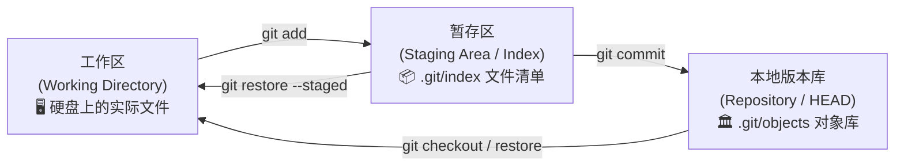
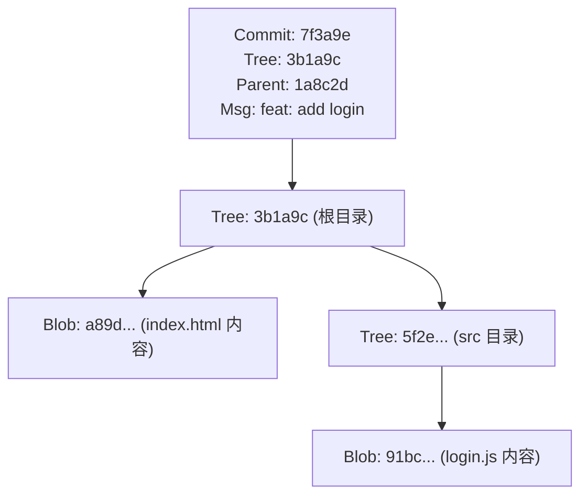
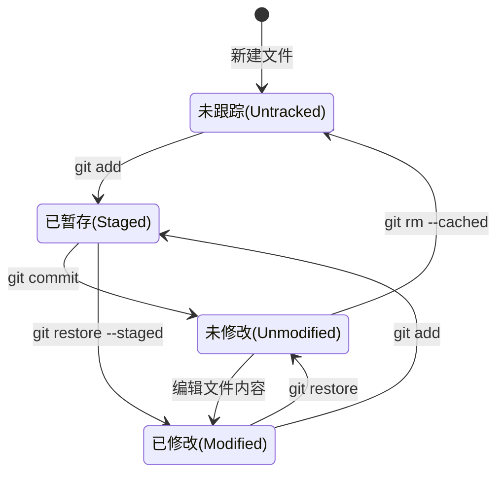
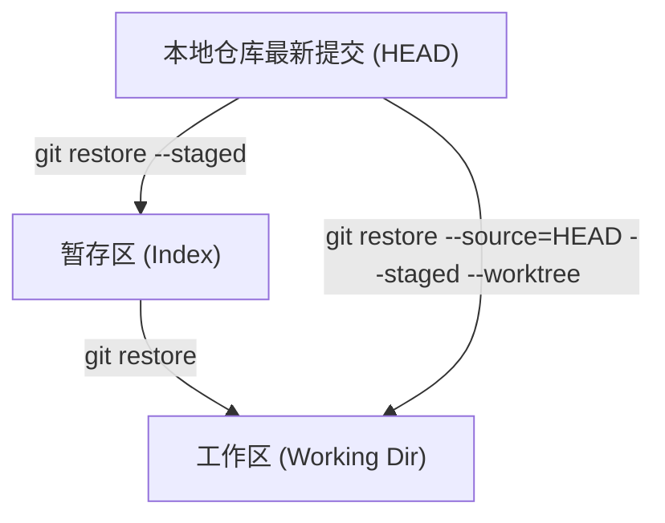

# 📦 阶段一：单兵作战与版本控制基础（深入透彻版）

> **所属规划**：[00gitplan.md](file:///d:/Learning/git/00gitplan.md) · 阶段一 (Day 1 ~ Day 3)  
> **核心使命**：彻底吃透 Git 的三层架构与底层存储模型，掌握单人开发下的生命周期循环，并能从容应对各种撤销与状态比对场景。

---

## 目录
1. [🧠 核心概念与底层模型透析](#1-核心概念与底层模型透析)
   - [1.1 为什么是 Git？集中式 vs 分布式](#11-为什么是-git集中式-vs-分布式)
   - [1.2 Git 的三大区域（Three Trees）](#12-git-的三大区域three-trees)
   - [1.3 Git 底层三大对象：Blob、Tree、Commit](#13-git-底层三大对象blobtreecommit)
   - [1.4 文件的 4 大生命周期状态](#14-文件的-4-大生命周期状态)
2. [⚡ 核心命令精讲与实战技巧](#2-核心命令精讲与实战技巧)
   - [2.1 初始化与配置：git config & git init](#21-初始化与配置git-config--git-init)
   - [2.2 状态与暂存：git status & git add](#22-状态与暂存git-status--git-add)
   - [2.3 提交快照：git commit 与 commit --amend](#23-提交快照git-commit-与-commit---amend)
   - [2.4 差异比对三剑客：git diff 家族](#24-差异比对三剑客git-diff-家族)
   - [2.5 现代撤销体系：git restore 与 reset 对比](#25-现代撤销体系git-restore-与-reset-对比)
3. [🎯 经典实战场景题（带详细题解）](#3-经典实战场景题带详细题解)
   - [场景一：代码写乱了，如何精准放弃单个文件的未保存改动？](#场景一代码写乱了如何精准放弃单个文件的未保存改动)
   - [场景二：误执行 git add . 把密钥文件也暂存了，如何移出暂存区且不删本地代码？](#场景二误执行-git-add--把密钥文件也暂存了如何移出暂存区且不删本地代码)
   - [场景三：刚 commit 完发现漏加了一个小图标，不想产生多余垃圾提交怎么办？](#场景三刚-commit-完发现漏加了一个小图标不想产生多余垃圾提交怎么办)
   - [场景四：同一个文件改了 10 处，只想暂存其中 5 处提交，怎么做？（高级技巧）](#场景四同一个文件改了-10-处只想暂存其中-5-处提交怎么做高级技巧)
   - [场景五：深度面试题：为什么 Git 必须设计“暂存区”？直接从工作区 commit 不好吗？](#场景五深度面试题为什么-git-必须设计暂存区直接从工作区-commit-不好吗)
   - [场景六：黑客探秘：用底层的 git cat-file 揭开 .git 目录真实面纱](#场景六黑客探秘用底层的-git-cat-file-揭开-git-目录真实面纱)
4. [📝 阶段一通关自测清单](#4-阶段一通关自测清单)

---

## 1. 🧠 核心概念与底层模型透析

### 1.1 为什么是 Git？集中式 vs 分布式

在传统的集中式版本控制系统（如 SVN）中，代码库集中存放在中央服务器上。开发者本地只有最新代码的一个副本，**断网就无法提交、无法查看完整历史、服务器单点故障可能导致历史全毁**。

而在 Git 中：
- **每个人的电脑都是一个完整的版本库**：包含完整的提交树、所有分支、所有历史快照。
- **离线操作飞快**：提交、切分支、查历史均在本地毫秒级完成，不需要连网。
- **内容快照（Snapshot）而非增量差异（Delta）**：SVN 保存的是每个文件每一次版本间的变更差异补丁；而 Git 每次提交保存的是整个项目目录的**完整快照索引**（没变的文件直接复用旧指针，极度节省空间且检索性能达到 $O(1)$）。

---

### 1.2 Git 的三大区域（Three Trees）

Git 的核心运作机制建立在三棵树（Three Trees）之上：



| 区域 | 本质位置 | 作用与职责 |
| :--- | :--- | :--- |
| **工作区 (Working Directory)** | 你的项目物理文件夹 | 开发者可见的实体代码文件，在这里敲代码、删减文件。处于不可审计状态。 |
| **暂存区 (Staging Area / Index)** | `.git/index` 二进制文件 | **版本的准备室 / 缓冲区**。记录即将提交的文件路径、文件元数据与 SHA-1 内容哈希。 |
| **本地版本库 (Repository)** | `.git/objects` 数据库 | 已经永久沉淀的提交历史。由 HEAD 指针指向当前活跃的分支与 Commit 对象。 |

> [!TIP]
> **暂存区（Index）是 Git 最伟大的发明之一**。它允许你有条不紊地准备下一次提交：即便你在工作区修改了 10 个文件，你也可以只 `git add` 其中 2 个，形成一个高内聚、职责单一的 Commit。

---

### 1.3 Git 底层三大对象：Blob、Tree、Commit

Git 的底层被称为一个“内容寻址文件系统（Content-addressable filesystem）”。你在 Git 里看到的任何数据，最终都会计算一个 40 位的 SHA-1 哈希值并存放在 `.git/objects/` 中：

1. **Blob 对象（Binary Large Object）**：
   - 只存储**文件的原始内容**（内容经过 zlib 压缩）。
   - **Blob 不存文件名、也不存目录层级或权限**！两份内容一模一样但名字不同的文件，在 Git 里只会生成一个 Blob 对象。
2. **Tree 对象**：
   - 相当于操作系统的**文件夹（Directory）**。
   - 记录其内部包含的所有文件名、文件权限（Mode）、以及它们对应指向的 Blob SHA-1 或子 Tree SHA-1。
3. **Commit 对象**：
   - 记录一次提交的元信息：
     - 指向顶层目录的 `Tree` 对象哈希（这就是项目在该版本的完整快照！）；
     - 父提交（Parent）指针（上一次 commit 的哈希，首个 commit 没有 parent）；
     - 作者（Author）、提交者（Committer）与时间戳；
     - 提交说明信息（Commit Message）。



---

### 1.4 文件的 4 大生命周期状态

工作区里的任何一个文件，在 Git 眼中必然处于以下 4 种状态之一：



- **未跟踪 (Untracked)**：Git 从未见过的全新文件，尚未纳入版本管理体系。
- **未修改 (Unmodified)**：已纳入版本控制，且当前文件内容与仓库最新 Commit 完全一致。
- **已修改 (Modified)**：文件已被 Git 追踪，但你在工作区对它进行了修改，改动尚未进入暂存区。
- **已暂存 (Staged)**：修改已经被收集到了暂存区（Index），等待执行 `git commit`。

---

## 2. ⚡ 核心命令精讲与实战技巧

### 2.1 初始化与配置：`git config` & `git init`

#### 配置优先级（从小到大覆盖）
1. **System 级**：`--system`（对全操作系统所有用户生效，存放于 `/etc/gitconfig`）
2. **Global 级**：`--global`（对当前登录操作系统的用户生效，存放于 `~/.gitconfig`，**最常用**）
3. **Local 级**：`--local`（只对当前所在的特定 Git 仓库生效，存放于 `.git/config`，优先级最高）

```bash
# 配置姓名与邮箱（作为每一次 Commit 的签名元数据）
git config --global user.name "Your Name"
git config --global user.email "you@example.com"

# 配置默认分支名为 main（GitHub 现代规范，告别 master）
git config --global init.defaultBranch main

# 查看当前生效的所有配置以及来源文件（极其实用！）
git config --list --show-origin
```

#### 初始化仓库
```bash
git init
```
> **剖析 `.git` 核心目录**：
> - `HEAD`：当前正在检出的分支指针（如 `ref: refs/heads/main`）。
> - `config`：当前仓库的本地专有配置文件。
> - `index`：暂存区二进制索引（执行 `git add` 后生成）。
> - `objects/`：Git 的对象数据库（存放所有的 Blob、Tree、Commit）。
> - `refs/`：存放本地分支指针（`refs/heads/`）和标签指针（`refs/tags/`）。

---

### 2.2 状态与暂存：`git status` & `git add`

#### 优雅查看状态
```bash
git status       # 详细输出
git status -s    # 精简输出（推荐日常使用）
```
> **精简状态符号解析**（两个字母分别代表：**暂存区状态** 与 **工作区状态**）：
> - `??`：未跟踪的新文件（Untracked）
> - ` A`：新增加并已暂存（Staged）
> - ` M`：已修改并已暂存（Staged）
> - ` M`（第二列有 M）：工作区有修改但**未暂存**
> - `MM`：既暂存了一部分，工作区后来又修改了一部分

#### 暂存操作
```bash
git add file1.txt          # 暂存单个文件
git add src/               # 暂存整个目录
git add .                  # 暂存当前路径下的所有新增与修改
git add -A                 # 暂存工作区所有新增、修改与删除的文件（全量）
git add -p                # 交互式挑选代码块（Hunk）暂存，极其优雅！
```

---

### 2.3 提交快照：`git commit` 与 `commit --amend`

```bash
# 规范提交（语义化 message）
git commit -m "feat(auth): 新增用户登录短信验证码校验逻辑"

# 极简模式：跳过 git add 直接提交已被追踪的已修改文件（不会包含新创建的 Untracked 文件）
git commit -am "fix: 修复登录按钮在移动端点击失效的问题"
```

#### 救命神器：`git commit --amend`
如果你刚做完一次 commit，突然发现：
- 漏掉了一个小配置或者打错了一个单词；
- 提交信息（commit message）写错了。

```bash
# 1. 把漏掉的文件加进暂存区
git add forgotten_file.js

# 2. 追加到上一个 commit（替换它）
git commit --amend --no-edit   # 不修改原有提交信息，静默吸纳

# 或者重新编辑上一次的提交信息
git commit --amend -m "feat(auth): 新增用户登录完整逻辑并修正配置文件"
```
> ⚠️ **底层原理**：`--amend` 并不是在原 commit 对象上修改（Git 对象是不可变的！），而是**创建了一个全新的 Commit 对象，并将分支指针向前替换，抛弃旧的 Commit**。

---

### 2.4 差异比对三剑客：`git diff` 家族

| 命令 | 比对目标 | 适用场景 |
| :--- | :--- | :--- |
| `git diff` | **工作区** vs **暂存区** | 准备 `git add` 前，检查自己键盘敲了哪些还没暂存的改动 |
| `git diff --staged` 或 `--cached` | **暂存区** vs **最近一次提交 (HEAD)** | 准备 `git commit` 前，终审即将提交到历史里的改动快照 |
| `git diff HEAD` | **工作区** vs **最近一次提交 (HEAD)** | 一眼看清自从上次 commit 以来所有的修改（无论是否暂存） |
| `git diff commitA commitB` | 两次历史 Commit 之间的全部差异 | 比对版本发布或功能合并前后代码变动 |

---

### 2.5 现代撤销体系：`git restore` 与 reset 对比

Git 2.23 版本以前，撤销文件和切换分支都混用 `git checkout`，令初学者十分困惑。现代 Git 拆分出了语义明确的 `git restore`：



#### 常用撤销操作速记
```bash
# 1. 撤销工作区的修改（丢弃打字修改，回到暂存区或 HEAD 的状态）
git restore <file>
git restore .                  # 丢弃当前目录所有未暂存修改

# 2. 把文件从暂存区撤回工作区（保留文件内容修改，只是从暂存区移除）
git restore --staged <file>

# 3. 一步到位：同时撤销暂存区和工作区，让文件彻底还原到 HEAD 的模样
git restore --source=HEAD --staged --worktree <file>

# 4. 从暂存区完全取消跟踪某文件（使文件变回 Untracked，本地磁盘不删除）
git rm --cached <file>
```

---

## 3. 🎯 经典实战场景题（带详细题解）

### 场景一：代码写乱了，如何精准放弃单个文件的未保存改动？

#### ❓ 场景描述
你在重构一个前端项目，修改了 `app.js`、`style.css` 和 `config.json`。你检查后觉得 `app.js` 和 `style.css` 改得很棒，但 `config.json` 改得一团糟，而且系统报错。你希望**彻底放弃 `config.json` 的修改，恢复成上一次 commit 完好无损的样子，但绝不能影响其他两个文件**。此时你还没执行任何 `git add`。

<details>
<summary>👉 点击展开参考答案与解析</summary>

#### ✅ 正确操作
```bash
# 针对指定文件恢复，丢弃工作区的未保存改动
git restore config.json
```

#### 🔍 深度解析
- `git restore <file>` 会用暂存区（如果暂存区没有，则用当前 HEAD）中的版本覆盖工作区中的对应文件。
- 如果使用的是老版本 Git（2.23 之前），对应等价命令为：`git checkout -- config.json`。
- **注意**：工作区未被版本控制记录的修改一旦执行 `restore` 就会被永久覆盖丢失，执行前务必确认改动确实不需要。
</details>

---

### 场景二：误执行 `git add .` 把密钥文件也暂存了，如何移出暂存区且不删本地代码？

#### ❓ 场景描述
你在项目根目录下创建了一个包含数据库密码和私钥的 `.env.local` 文件。敲键盘一时顺手执行了：
```bash
git add .
```
执行 `git status` 时，发现 `.env.local` 赫然躺在 `Changes to be committed`（绿色暂存区）中！
你想要把 `.env.local` 移出暂存区，**但绝不能把本地磁盘上的这个文件给删除了**，并且顺便确保以后再执行 `git add .` 它都不会被误加入。

<details>
<summary>👉 点击展开参考答案与解析</summary>

#### ✅ 正确操作步骤
```bash
# 第一步：将文件从暂存区移出（现代推荐命令）
git restore --staged .env.local

# （或者使用传统命令解除暂存）
# git rm --cached .env.local

# 第二步：将该文件模式写入 .gitignore，杜绝后患
echo ".env.local" >> .gitignore

# 第三步：查看状态确认
git status -s
```

#### 🔍 深度解析
- `git restore --staged <file>` 的作用是：用 HEAD 中的快照覆盖暂存区中的快照，由于 HEAD 中原本就没有该文件，因此相当于直接把它从暂存区（Index）注销，但**完全不动你硬盘上的工作区文件**。
- `git rm --cached <file>` 会从 index 清单中删除该路径的追踪，同样保留工作区物理文件。
- **特别警告**：千万不要写成 `git rm -f <file>`，加了 `-f` 且没有 `--cached` 的话，Git 会把你硬盘上的实体文件连根拔起删掉！
</details>

---

### 场景三：刚 commit 完发现漏加了一个小图标，不想产生多余垃圾提交怎么办？

#### ❓ 场景描述
你刚刚完成了一个登录模块，并写了非常规范的提交信息：
```bash
git commit -m "feat(auth): 支持手机号与短信验证码登录"
```
敲完回车才一秒钟，你一拍大腿：把刚下载到 `assets/icon-phone.png` 的手机图标图片漏提交了！
如果你再来一次 `git add assets/` 然后 `git commit -m "fix: 补充手机图标"`，提交历史就会出现难看的碎片提交，显得极其不专业。该如何优雅处理？

<details>
<summary>👉 点击展开参考答案与解析</summary>

#### ✅ 正确操作
```bash
# 1. 将遗漏的图标暂存
git add assets/icon-phone.png

# 2. 追加合并到上一次提交，且不修改原来的提交说明
git commit --amend --no-edit
```

#### 🔍 深度解析
- `git commit --amend` 会把当前暂存区中的所有变更，与上一个 Commit 的内容合并打包成一个**全新的 Commit**，并用新 Commit 替换原来的指针位置。
- `--no-edit` 参数告诉 Git：“沿用之前的提交说明，不要再弹出 Vim 让我改字了”。
- 此时执行 `git log -n 1 --stat`，你会看到上一次 commit 中已经优雅地包含了刚才补上的小图标，提交历史保持极其整洁。
- ⚠️ **使用前提**：该 Commit **尚未推送到公共远程仓库**。如果已经推送，使用 amend 需要强推（`--force-with-lease`），多人协作下需格外谨慎。
</details>

---

### 场景四：同一个文件改了 10 处，只想暂存其中 5 处提交，怎么做？（高级技巧）

#### ❓ 场景描述
你在 `utils.js` 里面连续编码了一上午：
- 前 50 行写的是一个修复“日期格式化时区偏差”的紧急 Bug；
- 后 100 行写的是一个全新的“大数金额千分位格式化”特性。
现在主管让你先把“日期修复 Bug”立即提交发版，而“金额格式化”特性还没测试完，不能提交。
但两个改动**都在同一个 `utils.js` 文件里**！如何只暂存该文件的上半部分修改并提交？

<details>
<summary>👉 点击展开参考答案与解析</summary>

#### ✅ 正确操作：使用补丁交互式暂存（Interactive Staging）
```bash
git add -p utils.js
```

#### 交互流程详解
Git 会把文件的差异切分成一个个代码片段（称为 **Hunk**），并在控制台逐个询问你：
```text
Stage this hunk [y,n,q,a,d,s,e,?]?
```
常用命令按键说明：
- `y`：**Yes**，暂存当前这个代码块；
- `n`：**No**，不暂存当前这个代码块；
- `s`：**Split**，如果当前代码块太长，把它进一步细分成更小的块；
- `e`：**Edit**，手动在编辑器中编辑这一块具体包含哪些行；
- `q`：**Quit**，退出交互暂存。

针对本场景：
1. 遇到日期 Bug 修复的代码块时按下 `y`；
2. 遇到金额大数格式化的代码块时按下 `n`；
3. 执行 `git diff --staged` 确认暂存区里只包含日期修复的代码；
4. 执行提交：
   ```bash
   git commit -m "fix(utils): 修复日期时区格式化计算偏差"
   ```
5. 此时你会发现，金额特性的代码依然稳稳当当留在你的工作区中，随时可以继续开发！
</details>

---

### 场景五：深度面试题：为什么 Git 必须设计“暂存区”？直接从工作区 commit 不好吗？

#### ❓ 问题追问
“SVN 没有暂存区，一键 commit 多简单直观；Git 每次提交非得先 `git add` 再 `git commit`，这不是多此一举脱裤子放屁吗？请说说暂存区到底解决了什么关键问题？”

<details>
<summary>👉 点击展开参考答案与解析</summary>

#### ✅ 核心论点梳理

1. **版本解耦与原子提交（Atomic Commits）**：
   - 开发者在实际工作中往往会同时修改多个任务的代码（修了个 Bug、顺便改了个样式、又加了一句日志）。
   - 如果没有暂存区，提交时只能“全盘接受”或者“手动挑出别的文件剪切走”。
   - 暂存区提供了**精细化挑选**的能力：允许你把工作区混乱的现场，拆分成多个独立的、专注的、具有单一职责的原子提交（如 `git add file1 && git commit -m "fix:..."`，再 `git add file2 && git commit -m "refactor:..."`）。

2. **解决冲突的必要缓冲区（Merge Safety）**：
   - 当分支合并或 rebase 遇到代码冲突时，冲突解决的结果正是通过 `git add` 逐一写入暂存区，作为冲突已解决的仲裁标识。
   - 暂存区其实支持**多版本标记（Stage 1: 共同祖先，Stage 2: 目标分支 HEAD，Stage 3: 来源分支）**，是三方合并算法赖以工作的底层基础。

3. **提交前的最终校验场（Review Before Commit）**：
   - 通过 `git diff`（比对草稿）与 `git diff --staged`（比对即将定稿的合同），开发者拥有了在将代码刻入历史之前最后一层审阅机制，防止把临时 `console.log` 或测试密码带入正式仓库。

4. **性能极致优化**：
   - 执行 `git add` 的瞬间，Git 就已经把文件内容压缩并写入了 `.git/objects`（生成了 Blob 对象）。执行 `git commit` 时只需打包目录树和提交元数据，耗时极低。
</details>

---

### 场景六：黑客探秘：用底层的 `git cat-file` 揭开 `.git` 目录真实面纱

#### ❓ 实验要求
我们在终端里从零创建一个新文件夹，新建一个文件并 commit，然后不借用任何第三方 GUI 工具，只用 Git 底层管道命令（Plumbing Commands）把刚才生成的 Blob、Tree、Commit 的真实内容打印出来，亲眼证明 Git 的对象存储模型。

<details>
<summary>👉 点击展开参考答案与解析</summary>

#### 🛠️ 实操验证全过程

```bash
# 1. 准备一个干净环境
mkdir git-deep-dive && cd git-deep-dive
git init

# 2. 创建一个内容为 "hello world" 的文件
echo "hello world" > hello.txt
git add hello.txt
git commit -m "init: first commit"

# 3. 查看最近一次 commit 的完整哈希
git rev-parse HEAD
# 假设输出: 9c2b9a1...

# 4. 查看 Commit 对象的类型与内容
git cat-file -t HEAD       # 输出: commit (对象类型)
git cat-file -p HEAD       # 打印 commit 内部存储的原始明文
```
你会看到类似如下的纯净底层结构：
```text
tree e307c037841ee1459a9e223d6a9a8342416b71e7
author Alice <alice@example.com> 1700000000 +0800
committer Alice <alice@example.com> 1700000000 +0800

init: first commit
```

继续顺藤摸瓜查看它指向的 `tree` 对象：
```bash
git cat-file -p e307c037841ee1459a9e223d6a9a8342416b71e7
```
输出：
```text
100644 blob 3b18e512dba79e4c8300dd08aeb37f8e728b8dad    hello.txt
```
> 💡 **顿悟时刻**：你看！Tree 对象里清清楚楚记录着：文件权限 `100644`、类型 `blob`、内容哈希 `3b18e51...`、以及文件名 `hello.txt`！

最后查看该 Blob 对象的内容：
```bash
git cat-file -p 3b18e512dba79e4c8300dd08aeb37f8e728b8dad
```
输出：
```text
hello world
```
至此，Git 的“内容寻址机制”与“Blob ➔ Tree ➔ Commit”三级索引模型彻底得到证实！
</details>

---

## 4. 📝 阶段一通关自测清单

如果你能不看本教材独立完成以下要求，说明你已彻底通关阶段一：

- [ ] 能脱稿画出：**工作区、暂存区、本地版本库**之间的数据流动关系。
- [ ] 清楚知道 `.git` 文件夹下 `HEAD`、`index`、`objects` 的作用。
- [ ] 掌握 `git status -s` 中两列字符分别代表哪两个区域的状态。
- [ ] 遇到写错或漏提的文件，能熟练使用 `git commit --amend` 修正。
- [ ] 能准确根据场景选择 `git diff` 或 `git diff --staged` 进行审查。
- [ ] 熟练掌握现代 `git restore` 撤销工作区修改或从暂存区退回。
- [ ] 知道 `git add -p` 可以在同一个文件中只选择一部分代码块暂存。
